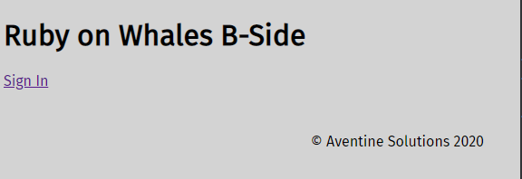

# Ruby on Whales: B Side
Version 0.1.26

Also the Coding Challenge for DAN.COM (via &Work)

from [Evil Martians](https://evilmartians.com/chronicles) and [Aventine Solutions](https://aventine.solutions/)

Validimir Dementyev's robust Docker/DockerCompose solution for Rails development.

* [Vladimir's Article](https://evilmartians.com/chronicles/ruby-on-whales-docker-for-ruby-rails-development)
* [Vladimir's Repository "Terraforming Rails"](https://github.com/evilmartians/terraforming-rails)

## Coding Challenge
Create a website where I can grade the whiskeys that I have had in the past.
Per whiskey, I would like to define the title, a small description and give it 
grades (1 to 5) for taste, color, and smokiness.  The data should be stored PostgreSQL.
 
I want to be able to search whiskey based on the title, description and/or minimum grade
 
Below requirements must be fulfilled:
 
* Backend should be in Ruby on Rails.
* Frontend should be written with React (preferably with React on Rails, so just one codebase)
* Tests should be written in `rspec`.

## Why Docker for Development?
* Guarantees to work cross platform
* Development could be set up in the Cloud (in the future).

## Prerequisites
* Windows 10: Docker Desktop for Windows
* MacOS: Docker Desktop for Mac
* Linux: install `docker` amd `docker-compose` via the package distribution

Dockers are Linux images (not Windows).
Note that `winpty` is only for Windows, leave it out on Linux and MacOS.

## Ruby Version
2.6.4

## Rails Version
6.0.2

## Bootstrapping the Application
Remove any leftover volumes from previous attempts, as they can get in a confused state:
```shell
% for v in bundle node_modules packs postgres rails_cache redis storage
do
  docker volume remove ruby_on_whales_b-side_"${v}"
done
# do we have a clean list?
% docker volume ls
```

Install the secret keys for encrypted secrets needed for development and test:
1) The development key goes in the file `config/credentials/development.key`
2) The test key goes in the the file `config/credentials/test.key`

Install Ruby/Rails dependencies
```shell
% winpty docker-compose run runner bundle install
```
It will take considerable time to download images and build the the development base image 
the first time the `runner` is used.

Install Frontend Node module dependencies
```shell
% winpty docker-compose run runner yarn
```

Update the Rails command scripts
```shell
% winpty docker-compose run runner app:update:bin
```

Create the databases (develop and test) and build the schemas
```shell
% winpty docker-compose run runner rake --trace db:create db:migrate db:test:prepare
```

Seed the development database (with Whiskeys)
```shell
% winpty docker-compose run runner rake --trace db:seed_up
```

Do a "smoke test" of the Rails app by trying the console
```shell
% winpty docker-compose run runner rails console
Loading development environment (Rails 6.0.2.1)
irb(main):001:0> Whiskey.pluck(:id)
=> ["a40e5da2-2726-4fdc-a0ec-2d8c906dca3c", "3b399839-50b4-4a3e-8537-f75d0831b105", "37445157-c684-4299-914d-97847cc00683", "f0ac1935-06de-4107-b2f4-731606747
466", "a6508ae5-b5f7-4bc4-9a5b-12c9842cfb64"]
```

Create at least one account, remembering the password
```shell
% winpty docker-compose exec runner rails console
# Account.create!(email: 'california@goldenbears.org', password: '<secret>', password_confirmation: '<secret>')
```

Finally, allow `docker-compose` to run and orchestrate the development containers:
```shell
% winpty docker-compose up
```

If everything succeeded, you should see containers running for Rails, Webpack(er), Postgres, Redis,
Sidekiq all running:
```shell
% docker-compose ps
              Name                             Command               State                        Ports
----------------------------------------------------------------------------------------------------------------------------
ruby_on_whales_b-side_app_1         irb                              Exit 0
ruby_on_whales_b-side_backend_1     irb                              Up
ruby_on_whales_b-side_postgres_1    docker-entrypoint.sh postgres    Up       0.0.0.0:5432->5432/tcp
ruby_on_whales_b-side_rails_1       bundle exec rails server - ...   Up       0.0.0.0:3001->3001/tcp
ruby_on_whales_b-side_redis_1       docker-entrypoint.sh redis ...   Up       0.0.0.0:32768->6379/tcp
ruby_on_whales_b-side_runner_1      /bin/zsh                         Up       0.0.0.0:3000->3000/tcp, 0.0.0.0:3002->3002/tcp
ruby_on_whales_b-side_sidekiq_1     bundle exec sidekiq -C con ...   Up
ruby_on_whales_b-side_webpacker_1   ./bin/webpack-dev-server         Up       0.0.0.0:3035->3035/tcp
```

The `runner` can be used to run Rails, Rake and Yarn commands, even the Z-Shell:

```shell
% winpty docker-compose exec runner rails console
```

The Rails server is provided from the "rails" container on port 3001: [http://localhost:3001](http://localhost:3001)



A server may also be run from the "runner" container, for instance to do "bye bugging"
```shell
% winpty docker-compose exec runner rails server -b 0.0.0.0 --port 3000
```

The "runner" container exposes ports 3000 and 3002.  You will have to shut down the other "rails" container and delete the
server PID file if necessary:
```shell
% rm -fv ./tmp/pids/server.pid
```

IDE Debugging may be done using "ruby remote debug" and the "rails-ide-debug" container.  It uses port 4000 for the
server [http://localhost:4000](http://localhost:4000).  The other Rails container must be stopped and the `server.pid`
file deleted before starting a debug session.

The Jet Brains set-up for "ruby remote debug" looks something like this.


## Running the system and managing containers

Bring up the system
```shell
% docker-compose up
```
Stopping container processes
```shell
% docker-compose stop
```
Stopping and removing containers
```shell
% docker-compose down
```
Running database tasks with `rake`
```shell
% winpty docker-compose exec runner rake --trace db:migrate
```

## Testing
Backend testing is done with RSpec
```shell
% winpty docker-compose exec runner bundle exec rspec
```
Factories are found in `./spec/factories`.

Frontend testing is done with Jest and Enzyme
```shell
% winpty docker-compose exec runner yarn test
# to watch tests
% winpty docker-compose exec runner yarn test-watch
```

## Linting
Ruby linting is done with Rubocop :cop:
```shell
% winpty docker-compose exec runner bundle exec rubocop
```
TODO's are found in `./.rubocop_todo.yml`.

Javascript linting is done with ES Lint :cop:
```shell
% winpty docker-compose exec runner yarn lint
# try automatic fixes
% winpty docker-compose exec runner yarn lint-fix
```
ES lint configuration is in `./eslintrc`

Style linting for SCSS is done with `stylelint`
```shell
% winpty docker-compose exec runner yarn stylelint
```
Style lint configuration can be found in `./stylelintrc.json`

## Seed Whiskeys
This seeds the Whiskey model including upload photos to Backblaze: 
```shell
% winpty docker-compose exec runner rake --trace db:seed_fu
```

## Add Accounts
Accounts may *only* be added using the Rails console at this time:
```shell
% winpty docker-compose exec runner rails console
# Account.create!(email: 'someone@nowhere.org', password: '<secret>', password_confirmation: '<secret>')
```


## Needs Improvement
* cleanup up RSpec includes and helpers for view, controller and request tests that need Devise/Warden
* prefer HAML over ERB
* have variant sizes for the Whiskey images
* have different Backblaze B2 buckets for each of the environments
* use [Sentry](https://sentry.io) to log errors from the Apollo client
* could consider using TypeScript for the frontend
* improved type checking in the frontend for things like UUID,  URL's and enums.
* "real" authentication for GraphQL ([read this](https://www.howtographql.com/graphql-ruby/4-authentication/))
* self registration and confirmation of accounts with emails using [Mandrill](https://mandrillapp.com)
* Improve support for UUID's in GraphQL
* For performance, dive into "N+1" queries, connection types and pagination with GraphQL
* Define GraphQL enum types for "quality" and "stars"
* Could be bi-lingual Dutch and English using I18n and React `<Trans/>`
* Use local Kubernetes instead of "docker compose" for orchestration.
* Invalidate the appropriate Apollo cached queries after a Ratings mutation 
  ([read this](https://medium.com/@martinseanhunt/how-to-invalidate-cached-data-in-apollo-and-handle-updating-paginated-queries-379e4b9e4698)).
* Mocks for Apollo need some work (inconsistent results with Enzyme)
